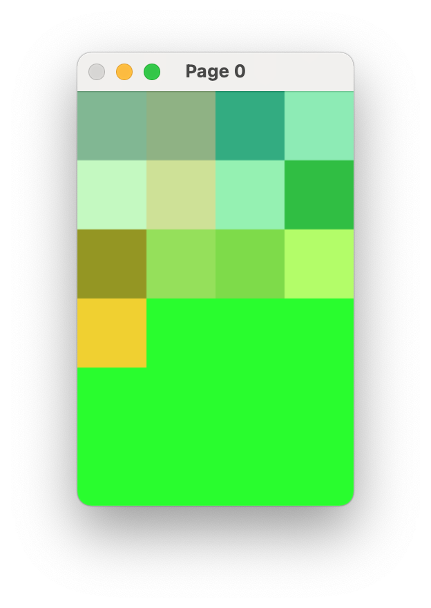
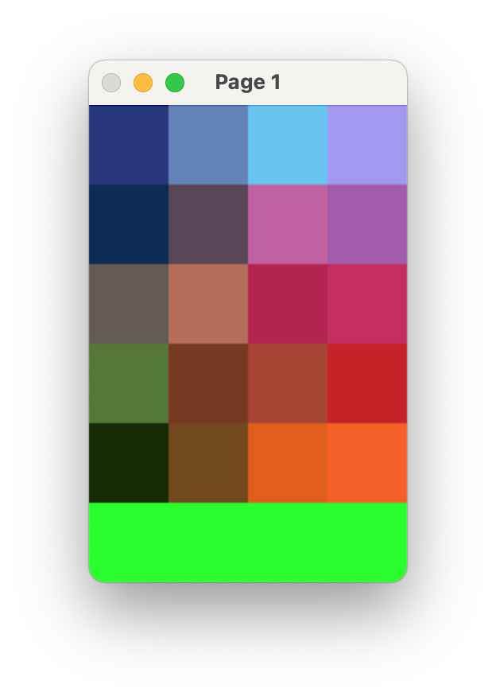
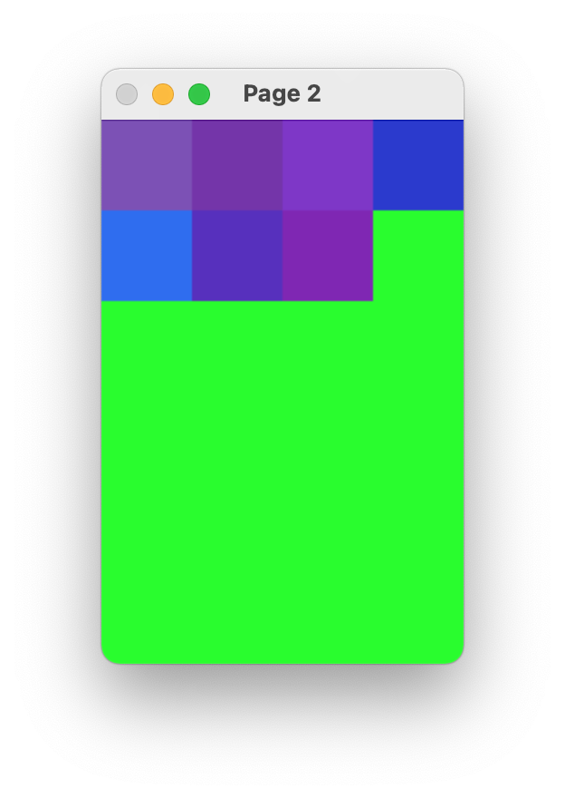

# Mosaic

Mosaic is an application that arranges icons on the home screen of your iOS device by color using evolutionary algorithms... Will be.

This is currently a work in progress and all it does right now is just arranging solid colors into home screen pages using a simple mutation.

## Installation

Everything is built with CMake. Before we begin installing the project we need to make sure the two dependencies OpenCV and GoogleTest are available on your computer.

### OpenCV

You can download the OpenCV source code and install it into the directory `3rdparty/opencv`. 

There are binaries available for Windows but make sure that they are made for your compiler. Otherwise you'll still have to compile them yourself. Also, for Windows don't forget to add OpenCV `bin/` directory (Debug and Release) to your `PATH` variable.
The [OpenCV installation guide](https://docs.opencv.org/master/d3/d52/tutorial_windows_install.htmlhttps://docs.opencv.org/master/d3/d52/tutorial_windows_install.html) is a good first choice. 

If you already have OpenCV installed somewhere on your computer the installation script will attempt to find a global installation as a fallback in case no installation could be found in the directory `3rdparty/opencv`. 

### GoogleTest

CMake will attempt to build the GTest library from source. This is considered best practice for using GTest. Please download the latest version of GTest into the directory `3rdparty/googletest`.

If no sources are available, the script will try to find the binaries in the `3rdparty/googletest` directory. As a final fallback the script will check for a system-wide installation.

### Mosaic

Many IDEs like CLion and Visual Studio will have a plugin for working with CMake projects.

If you wish to compile from command line you can issue the following commands from the project directory:

```bash
mkdir build && cd build
cmake ..
make
```

## Arranging

In the directory `examples` you will find the only example you can run right now

```bash
# from the build directory
cd Arrange/examples
./Example1
```

Setting `seed=0` will yield the following pages

| |  | |
|---|---|---|