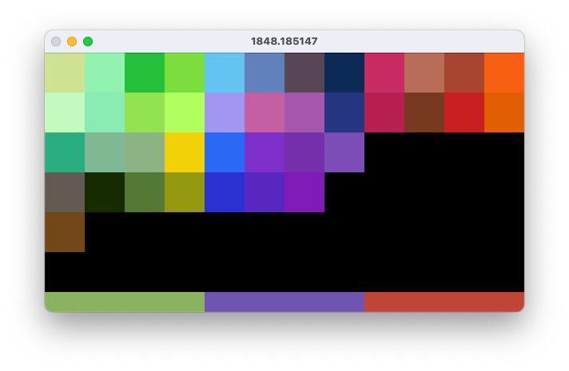

# Mosaic

Mosaic is an application that arranges icons on the home screen of your iOS device by color using evolutionary algorithms.

This is currently a work in progress, and all it does right now is just arranging solid colors into home screen pages using a simple mutation.

## Constrains

This library is only made for arranging icons on old school screen layouts. The screens are filled with icons from left to right and from top to bottom. Just as Steve Jobs intended. There is currently no support for widgets or arbitrary icon placement that was introduced in iOS 18.

## Installation

Everything is built with CMake. Image processing is done by OpenCV, and for testing we are using Google Test.

### OpenCV

First, make sure OpenCV is installed. You might need to point CMake to its location.

### GoogleTest

CMake will attempt to fetch GTest automatically.

### Mosaic

Many IDEs like CLion and Visual Studio will have a plugin for working with CMake projects.

If you wish to compile from the command line, you can issue the following commands from the project directory:

```bash
mkdir build && cd build
cmake ..
make
```

## Arranging

In the directory `examples` you will find the only example you can run right now

```bash
# from the build directory
cd Arrange/examples
./Example1
```

Setting `seed=0` will yield the following pages



Check out LAB, RGB and grayscale versions.
