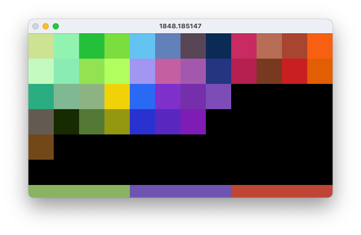

# Mosaic

Mosaic is an application that arranges icons on the home screen of your iOS device by color using evolutionary algorithms.

> If you'd like a coding agent to help you, point it to AGENTS.md (if it fails to discover it on its own). The description in this file will help the agent build the project, run the example scripts and guide you through the process of extracting the icons from the screenshots and arranging them.

## Constrains

This library is only made for arranging icons on the classic screen layouts. The screens are filled with icons from left to right and from top to bottom. Just as Steve Jobs intended. There is currently no support for widgets or arbitrary icon placement that was introduced in iOS 18.

## Installation

Everything is built with CMake. Image processing is done by OpenCV, and for testing we are using Google Test. Many IDEs like CLion and Visual Studio will have a plugin for working with CMake projects.

If you wish to compile from the command line, you can issue the following commands from the project directory:

```bash
mkdir build && cd build
cmake ..
make
```

## Examples

In the directory `examples` you will find three scripts.

- `GrayscaleIconsExample` creates icons with random grayscale colors and arranges them.
- `ColorIconsExample` creates icons with random colors and arranges them.
- `RealIconExample` reads images of real icons from a directory and arranges them.

Setting `seed=0` in `RealIconExample` will yield the following pages



## How does it all work?

INTRO HERE

This is essentially a Traveling Salesman Problem disguised by a multi-objective scoring function:

- Each icon must fit well with its neighbors
- Each page must present a color theme

Optimizing for the first two objectives, the algorithm tends to group a small number of similar icons and distribute these groups over a large number of pages. To counter this, we need a third objective:

- Each page must be filled to a viable maximum

While there are many approaches to solve such problems, I have decided that it would be fun to do it with a genetic algorithm.

### Formulation

The initial input is a set of icons. The arrangement of these icons is a _chromosome_ of an _individual_.

> Page breaks are made automatically when a page is filled. To allow for underfilled pages, we add Page-Break-Elements into the genome. They are treated in the same way as the icons.

In the beginning, a _population_ of a fixed number of _individuals_ is created. The _individuals_ in the first generation all have a random _chromosome_ i.e., a random arrangement of icons.

#### Strategy

With each generation increment, a number of modifications are applied to the population. Some _individuals_ die because they have reached the maximal age, some are passed into the new population without change (elites), some are mutated, and others die because they exhibit low overall fitness. Finally, the population is filled with new _individuals_ with a randomized _chromosome_.

#### Mutation

The only mutation implemented right now is swapping two _alleles_ in the _chromosome_ i.e., swapping the position of two icons. This is a simple operation that does not require to repair the _chromosome_ afterward.

#### Parameters

There are some parameters defined at the top of each example-class:

- `kPopulation`: Number of Individuals in a Population.
- `kGenerations`: Number of Generations for the algorithm to run.
- `kPageBreaks`: Number of Page-Break-Elements to be inserted into the _chromosome_.
- `kNumOfPieces`: Number of Icon-Pieces to generate (for solid-colored generated pieces).
- `kMaxAge`: Maximal age an Individual can reach before dying.
- `kPercentageElites`: Percentage of Individuals in a Population can pass to new Population without change (they are NOT removed form the old Population).
- `kPercentageMutants`: Percentage of Individuals in a Population will be mutated before passing to new Population.

### Fitness function

The fitness function of an individual consists of three metrics that are essentially playing against each other. Balancing their weights is tricky.

#### Distance

Distance score measures how similar an icon is to its neighbors. Direct neighbors of an icon are located to the north, east, south and west of an icon. We also account for diagonal neighbors to the north-east, south-east, south-west and north-west of an icon but their weight is only _sqrt(2)_.

#### Variance

First we calculate the mean color of all icons on the page. Then, in a second pass through, we compute the distance of the mean color to every icon on the page. Minimizing this score makes sure that each page has a color theme.

#### Missing icons

Finally, we need to penalize underfilled pages. Instead of defining a constant penalty value for every missing icon, we take the normalized variance score as base. Thus, for every empty slot on the page we add the same score as a mean-fitting icon would add.

#### Weights

The `FitnessWeights` struct passed to each _individual_ defines the weights for variance and the missing icon penalty. Changing these weights allows to find the balance between the three metrics.

### Color analysis

First, the icons are converted into Lab color space. Unlike RGB, Lab is uniformly distributed and yields the best results when comparing two colors. Our distance metric is simply the Euclidean distance.

Simply taking the mean icon color most likely produces a color that is not even present in the icon. Best results are achieved when we quantify the colors. In fact, as most icons consist of company logos on a solid (or gradient) background, it's enough to apply k-means clustering with two clusters. The fact that k-means uses euclidean distance, further supports the choice of the Lab color space.

In the end, each icon is represented internally as the two most dominant clusters weighted by their support.