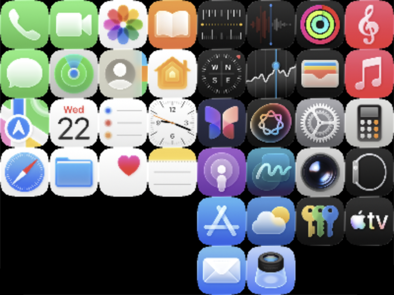
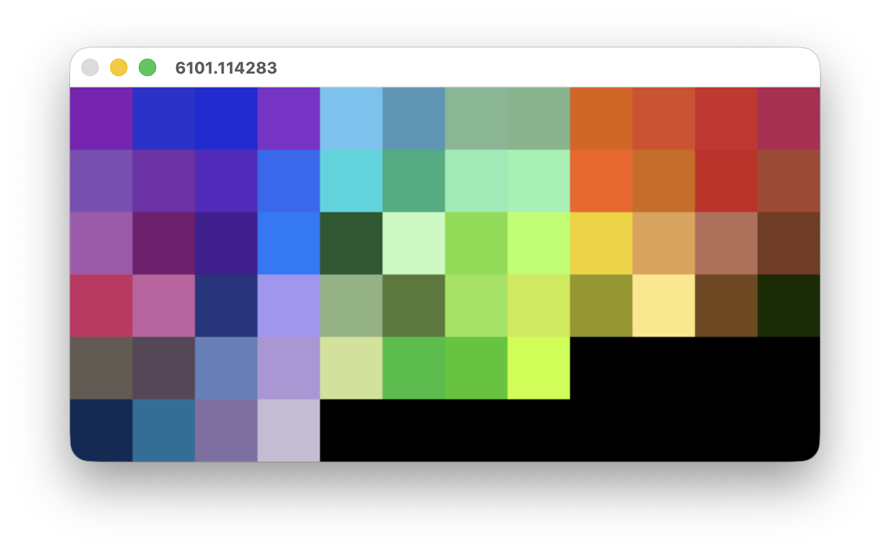
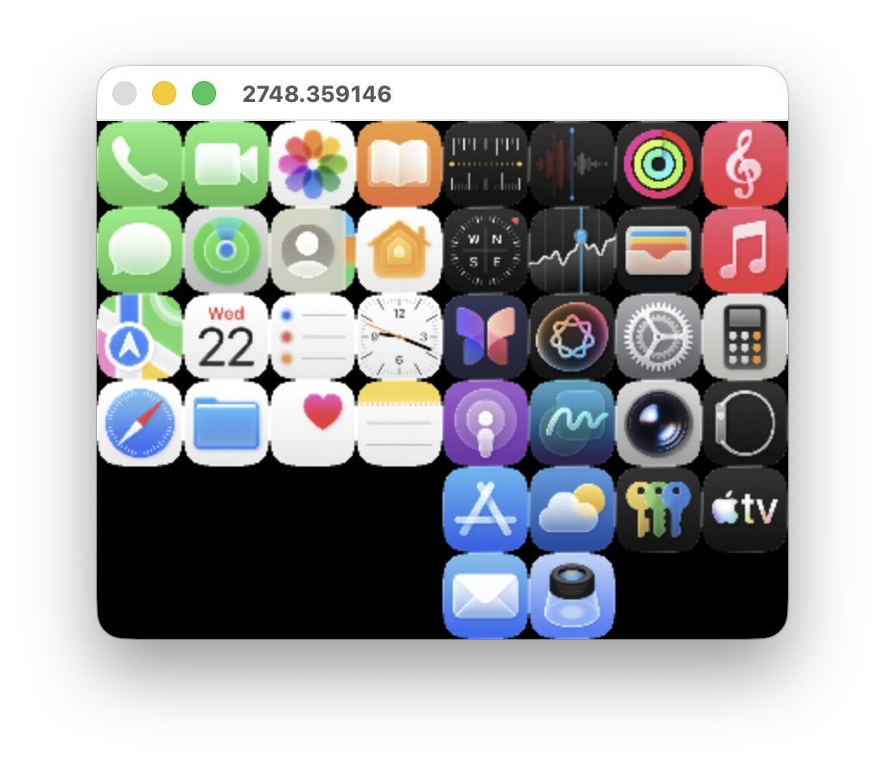

# Mosaic

Mosaic is an application that arranges icons on the home screen of your iOS device by color using evolutionary algorithms.

> If you'd like a coding agent to help you, point it to [AGENTS.md](AGENTS.md) (if it fails to discover it on its own). The description in this file will help the agent build the project, run the example scripts and guide you through the process of extracting the icons from the screenshots and arranging them.



## Constraints

Mosaic supports only the classic grid layout, where icons fill screens from left to right and top to bottom — just as Steve Jobs intended. Widgets and the arbitrary icon placement introduced in iOS 18 are not supported.

## Installation

The project is built with CMake, uses OpenCV for image processing, and Google Test for testing. IDEs like CLion and Visual Studio have built-in CMake support.

To build from the command line:

```bash
mkdir build && cd build
cmake ..
make
```

## Examples

The `examples` directory contains three executables.

- `GrayscaleIconsExample` creates icons with random grayscale colors and arranges them.
- `ColorIconsExample` creates icons with random colors and arranges them.
- `RealIconExample` reads images of real icons from a directory and arranges them.

Setting `seed=0` in `ColorIconsExample` produces the following pages:



Running `RealIconExample` with your own icons would produce something like this:



## How does it all work?

This is essentially a Traveling Salesman Problem disguised by a multi-objective scoring function:

- Each icon must fit well with its neighbors
- Each page must have a color theme

Optimizing for the first two objectives, the algorithm tends to group a small number of similar icons and distribute these groups over a large number of pages. To counter this, we need a third objective:

- Each page must be filled to a viable maximum

A genetic algorithm is a natural fit for this kind of combinatorial problem.

### Formulation

The initial input is a set of icons. The arrangement of these icons is a chromosome of an individual.

> Page breaks are made automatically when a page is filled. To allow for underfilled pages, we add Page-Break-Elements into the genome. They are treated in the same way as the icons.

In the beginning, a population of a fixed number of individuals is created. The individuals in the first generation all have a random chromosome i.e., a random arrangement of icons.

#### Strategy

Each generation applies a set of modifications to the population: individuals that have reached the maximum age are removed, low-fitness individuals are culled, a subset of top performers are carried over unchanged (elites), and some are mutated. The population is then topped up with freshly randomized individuals.

#### Mutation

The only mutation currently implemented is swapping two alleles in the chromosome — i.e., exchanging the positions of two icons. Because every icon appears exactly once, no repair step is needed afterward.

#### Parameters

Each example defines the following parameters at the top of the file:

- `kPopulation`: Number of individuals in a population.
- `kGenerations`: Number of generations for the algorithm to run.
- `kPageBreaks`: Number of Page-Break-Elements to be inserted into the chromosome.
- `kNumOfPieces`: Number of Icon-Pieces to generate (for solid-colored generated pieces).
- `kMaxAge`: Maximal age an individual can reach before dying.
- `kPercentageElites`: Percentage of individuals that are carried into the new population unchanged (they are NOT removed from the old population).
- `kPercentageMutants`: Percentage of individuals that are mutated before passing to the new population.

### Fitness function

The fitness function combines three competing metrics. Balancing their weights is the main tuning challenge.

#### Distance

The distance score measures how similar an icon is to its neighbors. Direct neighbors of an icon are located to the north, east, south and west of an icon. We also account for diagonal neighbors to the north-east, south-east, south-west and north-west of an icon, but their weight is only _sqrt(2)/2_.

#### Variance

First, the mean color of all icons on the page is computed. In a second pass, the distance from each icon to that mean is accumulated. Minimizing this score keeps each page visually cohesive.

#### Missing icons

Underfilled pages must be penalized. Rather than using a fixed constant, the penalty per empty slot is derived from the normalized variance score — so each gap costs the same as a perfectly average-fitting icon would.

#### Weights

The `FitnessWeights` struct passed to each individual defines the weights for variance and the missing icon penalty. Changing these weights allows to find the balance between the three metrics.

### Color analysis

Icons are converted to Lab color space, which is perceptually uniform — equal distances correspond to equal perceived differences, making it a better choice than RGB for color comparison. The distance metric is Euclidean distance.

Taking the mean color of an icon often produces a color that does not actually appear in the icon. Better results come from quantizing the colors instead. Since most icons consist of a logo on a solid or gradient background, k-means with two clusters is sufficient. The fact that k-means uses Euclidean distance makes it a natural fit for the Lab color space.

In the end, each icon is represented internally as the two most dominant clusters weighted by their support.

### Hall of Fame

The `HallOfFame` class maintains the top N individuals seen across all generations. You can attach a callback to it that fires whenever a new best individual is discovered — useful for logging progress or triggering an export automatically.

### Exporting results

Individuals can be exported to NDJSON format using the `JsonExport` module. The NDJSON format is append-friendly and crash-safe, making it practical for long-running evolutionary runs. Each line in the output file is a self-contained JSON object describing one individual.

### Visualization

The `visualization/` directory contains a Python environment and a Jupyter notebook (`mosaic_analysis.ipynb`) for inspecting and plotting exported individuals. See the notebook for examples of how to load and visualize the results.